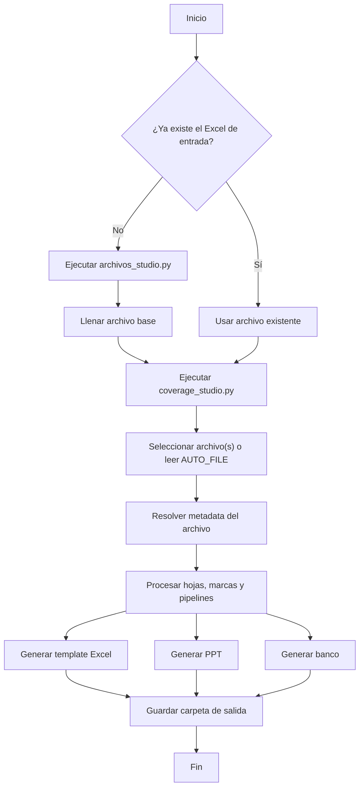

# CoverageLab


Automatiza el flujo de coberturas desde un archivo Excel de entrada hasta tres entregables finales:

- un `Template_...xlsx` de trabajo
- una presentación `...pptx`
- un `Banco_...xlsx` consolidado

El proyecto está centrado en `coverage_studio.py`, que procesa metadata del archivo, interpreta hojas por marca o pipeline, genera slides y construye el banco final.

## Contenido

- [Qué hace](#qué-hace)
- [Estructura del proyecto](#estructura-del-proyecto)
- [Requisitos](#requisitos)
- [Instalación](#instalación)
- [Uso rápido](#uso-rápido)
- [Formato del archivo de entrada](#formato-del-archivo-de-entrada)
- [Convenciones por hoja](#convenciones-por-hoja)
- [Casos especiales soportados](#casos-especiales-soportados)
- [Modo automático](#modo-automático)
- [Salidas generadas](#salidas-generadas)
- [Flujo general](#flujo-general)
- [Troubleshooting](#troubleshooting)
- [Notas operativas](#notas-operativas)

## Qué hace

`coverage_studio.py`:

- lee un `.xlsx` de entrada con estructura por hojas
- detecta país, categoría y fabricante desde el nombre del archivo
- arma un template Excel con cálculos y gráficos nativos
- genera el PPT final usando `Modelo_PPT.pptx`
- construye un banco de coberturas con metadata por marca, pipeline y contexto del archivo

Además, hoy ya incorpora lógica específica para:

- resolución de metadata `MULT` por hoja en casos como `55_MULT_Unilever.xlsx` y `12_MULT_Colgate.xlsx`
- llenado de `Subcategoria` en el banco a partir del texto entre paréntesis en el nombre de la hoja
- autoajuste de columnas en banco y template Excel
- mejor distribución de anchos y encabezados del `summary` dentro del PPT

## Estructura del proyecto

- `coverage_studio.py`: motor principal de generación
- `archivos_studio.py`: asistente para crear archivos base de captura
- `scorecards_studio.py`: exportador de scorecards
- `Modelo_PPT.pptx`: plantilla obligatoria para construir la presentación
- `requirements.txt`: dependencias Python

## Requisitos

- Python 3.8 o superior
- `pip` actualizado
- dependencias de `requirements.txt`
- `Modelo_PPT.pptx` presente en la raíz del proyecto

## Instalación

Instalación recomendada:

```bash
pip install -r requirements.txt
```

Si prefieres instalación manual:

```bash
pip install pandas numpy matplotlib openpyxl tqdm colorama rich dataframe_image scipy python-pptx pillow
```

## Uso rápido

### Flujo A: crear base y luego procesar

1. Genera un archivo base:

```bash
python archivos_studio.py
```

2. Llena el Excel con tus datos.
3. Ejecuta el proceso principal:

```bash
python coverage_studio.py
```

### Flujo B: procesar un archivo existente

1. Coloca el `.xlsx` en la raíz del proyecto.
2. Ejecuta:

```bash
python coverage_studio.py
```

### Flujo C: exportar scorecards

```bash
python scorecards_studio.py
```

El menú de formato permite generar:

1. `Unilever`
2. `Personalizado`
3. `Ambos (Unilever y Personalizado)`

La opción 3 exporta dos archivos independientes en la misma carpeta de salida,
uno con sufijo `_unilever.xlsx` y otro con sufijo `_personalizado.xlsx`.

## Formato del archivo de entrada

### Nombre del archivo

Formato esperado:

```text
<codPais>_<codCategoria>_<fabricante>.xlsx
```

Ejemplos:

- `52_NDCR_Nestlé.xlsx`
- `55_MULT_Unilever.xlsx`
- `12_MULT_Colgate.xlsx`

Consideraciones:

- el parser toma las tres primeras secciones separadas por `_`
- el país y la categoría salen del nombre del archivo
- el fabricante también se toma desde el nombre del archivo
- evita usar `_` extra dentro del fabricante si no son parte del formato esperado

## Convenciones por hoja

Cada hoja representa una marca, variante o agrupación.

### Secciones de la presentación

Cada hoja válida genera su propia sección de PowerPoint. El nombre de la
sección es el nombre visible de la hoja sin el prefijo `P0_` a `P6_`, y contiene
los slides consecutivos generados para esa hoja/pipeline (normalmente cobertura,
tendencia y evolución).

Las hojas no heredan la sección de una categoría o total anterior. Por ejemplo,
`P5_T.UL Sabonetes`, `P5_T.UL Sabonetes Barra` y `P2_T.UL FabClean` producen
secciones independientes llamadas `T.UL Sabonetes`, `T.UL Sabonetes Barra` y
`T.UL FabClean`.

### Prefijos de pipeline

Si una hoja empieza con `P0_` a `P6_`, ese prefijo fuerza que solo se procese ese pipeline.

Ejemplos:

- `P1_Coffee Mate` procesa solo pipeline 1
- `Coffee Mate` procesa todos los pipelines disponibles

### Subcategoría entre paréntesis

Si el nombre de la hoja incluye un texto entre paréntesis, ese valor se usa para llenar la columna `Subcategoria` del banco.

Ejemplos:

- `P1_Limpiadores(Spray)` -> `Subcategoria = Spray`
- `P1_Limpiadores(Aroma Bosque)` -> `Subcategoria = Aroma Bosque`
- `P1_Limpiadores` -> `Subcategoria` vacía

Regla actual:

- si el texto entre paréntesis coincide con el catálogo canónico, se usa ese valor
- si no coincide, se conserva el valor original recibido en la hoja

## Casos especiales soportados

### Archivos `MULT`

Para categorías `MULT`, el banco no siempre usa la metadata general del archivo. En ciertos fabricantes, la metadata se resuelve por hoja.

#### `55_MULT_Unilever.xlsx`

Se resuelven por hoja:

- `Categoria`
- `Cesta`

Esto permite clasificar correctamente marcas o variantes que no deben heredar una sola categoría global del archivo.

#### `12_MULT_Colgate.xlsx`

Se resuelven por hoja:

- `Categoria`
- `Cesta`
- `Pais`

Esto aplica cuando el nombre de la hoja trae el país como parte del texto, por ejemplo variantes tipo `... Honduras` o `... Costa Rica`.

## Modo automático

Si defines `AUTO_FILE`, `coverage_studio.py` corre sin preguntas interactivas.

Variables principales:

- `AUTO_FILE`: archivo `.xlsx` a procesar
- `AUTO_COV_TYPE`: `Absoluta`, `Relativa`, `AUTO` o `7` para AUTOEXPERIMENTAL
- `AUTO_RAZON`: razón del análisis
- `AUTO_EJE`: `simple` o `doble`
- `AUTO_TREND_MODE` o `AUTO_TREND_GRANULARITY`: `monthly` o `quarterly`
- `AUTO_ENGLISH`: `1` o `0`
- `AUTO_ROUND_COV`: `1` o `0`
- `AUTO_VAR_BOX_STYLE` o `AUTO_VAR_STYLE`: `classic` o `pretty`
- `AUTO_COV_SLIDE` o `AUTO_COV_SLIDE_STYLE`: `classic`, `complemented` o `pg`
- `AUTO_EVO_SLIDE` o `AUTO_EVO_SLIDE_STYLE`: `classic` o `simple`
- `AUTO_EXTEA` o `AUTO_EXTRA_MONTHS`: meses extra para summary, por ejemplo `8,11`
- `AUTO_EXTEA_MODE` o `AUTO_EXTRA_MONTHS_MODE`: `recent` o `both`
- `AUTO_INDEX` y `AUTO_TOTAL`: opcionales para corridas batch

Ejemplo en PowerShell:

```powershell
$env:AUTO_FILE = "52_NDCR_Nestlé.xlsx"
$env:AUTO_COV_TYPE = "Absoluta"
$env:AUTO_RAZON = "Actualización"
$env:AUTO_EJE = "simple"
$env:AUTO_ENGLISH = "0"
$env:AUTO_ROUND_COV = "0"
python coverage_studio.py
```

### AUTOEXPERIMENTAL: recomendación y comparación

La opción `7 - Template AUTOEXPERIMENTAL` genera PPT, summary y banco con el
pipeline `AUTO Balanceado`. Esta recomendación combina correlación, dirección e
intensidad de variación, perfil de categoría, longitud, historia y outliers.

No agrega dos opciones nuevas al menú. En su lugar, el `Reporte de Pipelines`
incluye como diagnóstico paralelo:

- `AUTO Correlación`: candidato con máxima correlación MAT del Año Actual
- `AUTO Balanceado`: recomendación utilizada en los entregables
- tipo de decisión balanceada
- conflicto entre ambos modos y pérdida de correlación
- mejora del gap de variación
- indicador de revisión requerida

En este modo el prefijo `P1_` a `P6_` se usa como evidencia/fallback, no como
restricción obligatoria. Fuera de AUTOEXPERIMENTAL conserva el comportamiento
documentado en [Prefijos de pipeline](#prefijos-de-pipeline).

## Salidas generadas

Por cada archivo procesado se crea una carpeta con esta estructura general:

```text
<Pais>-<CategoriaCorta>-<Fabricante>-<Ref>_<CoverageLabel>
```

Dentro se generan:

1. `Template_<Pais>-<CategoriaCorta>-<Fabricante>-<Ref>_<CoverageLabel>.xlsx`
2. `<Pais>-<CategoriaCorta>-<Fabricante>-<Ref>_<CoverageLabel>.pptx`
3. `Banco_<Fabricante>_<Categoria>_<Pais>_<Ref>_<CoverageLabel>.xlsx`
4. En modo AUTOEXPERIMENTAL: `Reporte de Pipelines ...xlsx`

### Banco de coberturas

El banco final incluye columnas de contexto de negocio y ejecución. Entre ellas:

- mes de ejecución
- periodo
- fabricante
- categoría
- cesta
- subcategoría
- panel
- unidad
- razón
- país

La metadata del banco puede venir:

- del nombre del archivo
- del nombre de la hoja
- de reglas específicas por fabricante en escenarios `MULT`

### Template Excel

El template:

- conserva cálculos y estructura de trabajo
- inserta gráficos nativos
- ajusta anchos de columna automáticamente para que la revisión sea más cómoda

### PPT

La presentación:

- se construye sobre `Modelo_PPT.pptx`
- incluye slides de cobertura, tendencia, evolución y summary
- ajusta mejor los anchos del `summary`
- parte visualmente los encabezados de cobertura como `Cobertura` arriba y `Mes-Año` abajo cuando aplica

## Flujo general



## Troubleshooting

- `Modelo_PPT.pptx` no existe:
  el script necesita la plantilla en la raíz del proyecto.

- No aparecen archivos Excel al iniciar:
  valida que terminen en `.xlsx`, que no empiecen con `~$` y que no estén abiertos o bloqueados.

- Error de metadata en el nombre:
  revisa el formato `<codPais>_<codCategoria>_<fabricante>.xlsx`.

- El banco no trae la categoría o cesta esperada en `MULT`:
  verifica si el caso depende del nombre de la hoja y no solo del nombre del archivo.

- La subcategoría no sale como esperabas:
  revisa el texto entre paréntesis en la hoja; si no coincide con el catálogo, el sistema conserva el valor original.

- Faltan dependencias:

```bash
pip install -r requirements.txt
```

- Error al guardar Excel o PPT:
  cierra archivos abiertos de la corrida anterior antes de volver a ejecutar.

## Notas operativas

- durante la ejecución se usa la carpeta temporal `tmp/` y se elimina al final
- `file_temp_coverage.xlsx` es un archivo auxiliar interno del proceso
- el proyecto hoy está pensado para uso operativo interno, no como librería empaquetada
- si agregas nuevos casos `MULT`, la extensión natural está en las reglas de metadata del módulo principal

## Licencia

Uso interno del equipo.
